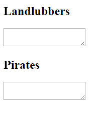

<h2 class="c-project-heading--task">Create the page layout</h2>

Update the starter code so the page has two text areas for normal text and pirate text.

<h2 class="c-project-heading--explainer">Follow these instructions</h2>

## Step 1

  <strong>Tip:</strong> The <code>id</code> names <code>normal</code> and <code>pirate</code> are important because your script will use them later. An <code>id</code> lets jQuery target one specific element.

## Step 2

Update `index.html` in the starter project.

--- code ---
---
language: html
filename: index.html
line_numbers: true
line_number_start: 1
line_highlights: 1,4-11,15-19
---
<!DOCTYPE html>
<html>
<head>

  <title>Talk like a Pirate</title> <!-- Update the page title -->
</head>
<body>

<h2>Landlubbers</h2> <!-- Label the normal text box -->
<textarea id="normal"></textarea> <!-- Create the input text area -->

<h2>Pirates</h2> <!-- Label the pirate text box -->
<textarea id="pirate"></textarea> <!-- Create the output text area -->

</body>
</html>
--- /code ---

  

## Now run your code

Open `index.html` in a browser and check that you can see a title and two large text boxes.
