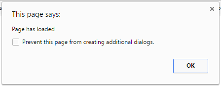

<h2 class="c-project-heading--task">Load jQuery when the page opens</h2>

--- task ---
Add jQuery and a ready event so you can confirm your page runs JavaScript after it has loaded.
--- /task ---

  <strong>Debug:</strong> If no pop-up appears, refresh the page and check that the jQuery <code>script src</code> line is inside the <code>&lt;head&gt;</code> section.

--- task ---
Update `index.html` to load jQuery and show an alert when the page is ready.

--- code ---
---
language: html
filename: index.html
line_numbers: true
line_number_start: 11
line_highlights: 12-17
---
  <title>Talk like a Pirate</title>
   <!-- Load the current jQuery library -->
  
</head>
--- /code ---

--- /task ---

  

--- task ---
**Test:** Refresh the page and check that a pop-up says `Page has loaded`.
--- /task ---
