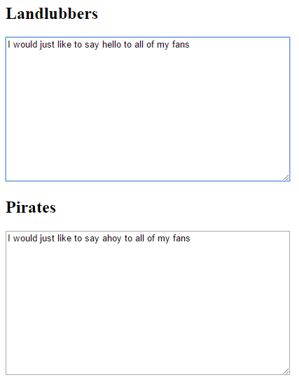

<h2 class="c-project-heading--task">Add pirate word replacements</h2>

### Step 1
Add lots of simple replacement rules so the translator swaps everyday words for pirate ones.

  <strong>Tip:</strong> The <code>g</code> and <code>i</code> flags make one rule work in more situations. <code>g</code> replaces every match in the text, and <code>i</code> ignores capital letters.

### Step 2
Add the main pirate word replacements to `index.html`.

--- code ---
---
language: html
filename: index.html
line_numbers: true
line_number_start: 15
line_highlights: 18-34
---
      $("#normal").on("keyup", function() {
          var words = $("#normal").val();

          words = words.replace(/ar/gi, "arrr"); // Stretch ar sounds to sound more pirate-like
          words = words.replace(/you/gi, "ye"); // Change you to ye
          words = words.replace(/your/gi, "yer"); // Change your to yer
          words = words.replace(/ for /g, " fer "); // Change for to fer
          words = words.replace(/ to /gi, " ter "); // Change to to ter
          words = words.replace(/ing/g, "in'"); // Drop the g from words ending in ing
          words = words.replace(/are/g, "be"); // Change are to be
          words = words.replace(/ is /g, " be "); // Change is to be
          words = words.replace(/was/g, "be"); // Change was to be
          words = words.replace(/the /g, "th'"); // Shorten the
          words = words.replace(/hello/gi, "Ahoy"); // Change hello to Ahoy
          words = words.replace(/stop/gi, "avast"); // Change stop to avast
          words = words.replace(/quickly/gi, "smartly"); // Change quickly to smartly
          words = words.replace(/friend/gi, "matey"); // Change friend to matey
          words = words.replace(/beer/gi, "grog"); // Change beer to grog
          words = words.replace(/I'm/g, "I be"); // Change I'm to I be
          words = words.replace(/ yes /gi, " aye "); // Change yes to aye

          $("#pirate").val(words);
      });
--- /code ---

  

### Step 3
**Test:** Type `Hello, you and your friend should stop for beer.` and check that the pirate box changes several words, including `Ahoy`, `ye`, `yer`, `matey`, `avast`, and `grog`.
