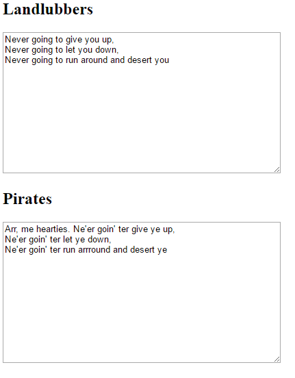

<h2 class="c-project-heading--task">Use regex for trickier pirate phrases</h2>

Add regex rules so the translator can change punctuation, word patterns, and the order of some pirate phrases.

<h2 class="c-project-heading--explainer">Follow these instructions</h2>

## Step 1

  <strong>Debug:</strong> The regex patterns work best when you test with a full sentence such as <code>Hello! I was never ready</code>. For example, <code>^</code> matches the start of the text, <code>(\\w+)!\\s</code> matches words before an exclamation mark, and <code>(\\w+)ev(\\w+)</code> finds words containing <code>ev</code>.

## Step 2

Add the final regex rules to `index.html`.

--- code ---
---
language: html
filename: index.html
line_numbers: true
line_number_start: 34
line_highlights: 36-40
---
          words = words.replace(/ yes /gi, " aye ");

          words = words.replace(/^/, "Arr, me hearties. "); // Add a pirate greeting to the start of the text
          words = words.replace(/(\w+)!\s/g, "$1! Yo ho ho! "); // Add a pirate shout after exclamations
          words = words.replace(/(\w+)ev(\w+)\s/g, "$1e'$2 "); // Change words like never to ne'er
          words = words.replace(/was\s(\w+)ed\s/g, "be $1ing "); // Turn was ...ed into be ...ing
          words = words.replace(/was/gi, "wer"); // Change any remaining was to wer after the regex above

          $("#pirate").val(words);
--- /code ---

  

## Now run your code

Type `Hello! I was never ready` and check that the pirate box adds `Arr, me hearties.`, adds `Yo ho ho!`, and changes `never` to `ne'er`.
